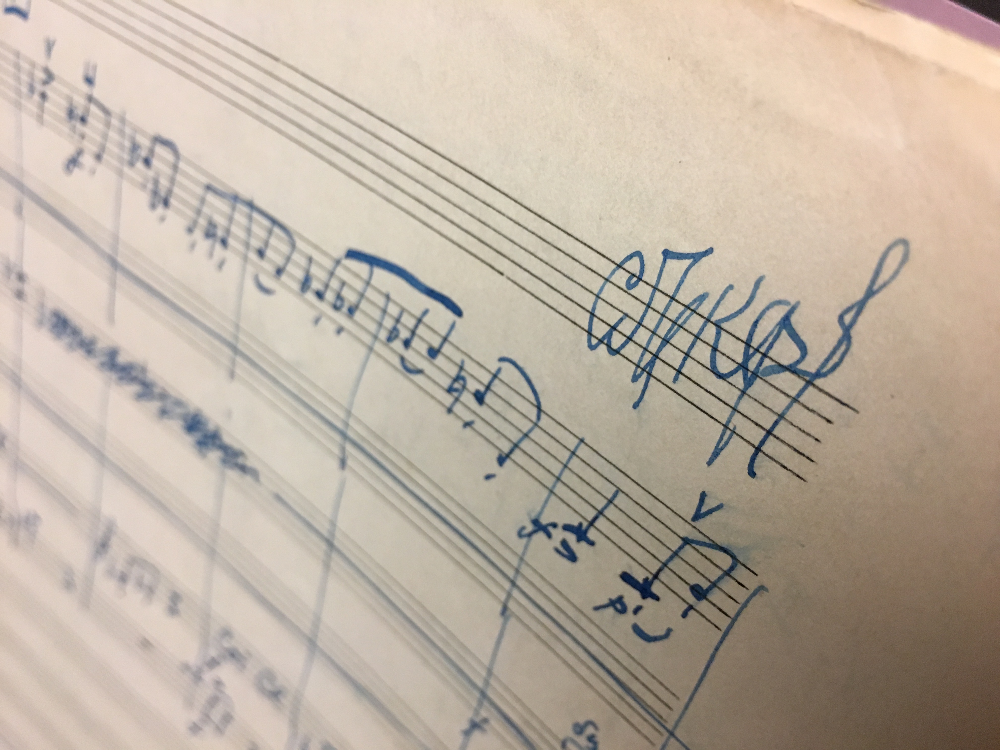

---
# Feel free to add content and custom Front Matter to this file.
# To modify the layout, see https://jekyllrb.com/docs/themes/#overriding-theme-defaults

layout: home
---
{:height="400px" width="600px"}

# The Serge Prokofiev Archive as Data 

## Using DH tools to explore archival collections

This project explores ways that DH methods and tools can transform our engagement with archival collections. Based on the robust material of the [Serge Prokofiev Archive Finding Aid](https://findingaids.library.columbia.edu/ead/nnc-rb/ldpd_10815449/summary), this project is part data curation, part data transformation, part data analysis and part data storytelling.
 
Inspired by the [Always Already Computational - Collections as Data](https://collectionsasdata.github.io/) movement in the library and archives community, we seek to show how data-driven engagement with archival data can generate new insights into Sergei Prokofiev (1891-1953) and his cultural context. By using a variety of text processing and transformation tools to release the data from the constraints of the library finding aid, we are able to employ various off-the-shelf data analysis tools and platforms for digital mapping (ArcGIS, QGIS, Neatline), data visualization (Raw, Palladio), and digital storytelling tools (Story Maps) to make discoveries about Prokofiev and the archive. 
 
By subverting hierarchies embedded in the traditional archival discovery systems, the data-driven approach empowers the researcher to compare, match, arrange and combine information, and generate knowledge in ways that conventional finding aids do not.

This project is a collaboation between [Natalia Ermolaev](https://www.nataliaermolaev.com/) and [Mark Saccomano](https://music.columbia.edu/bios/mark-saccomano). 

